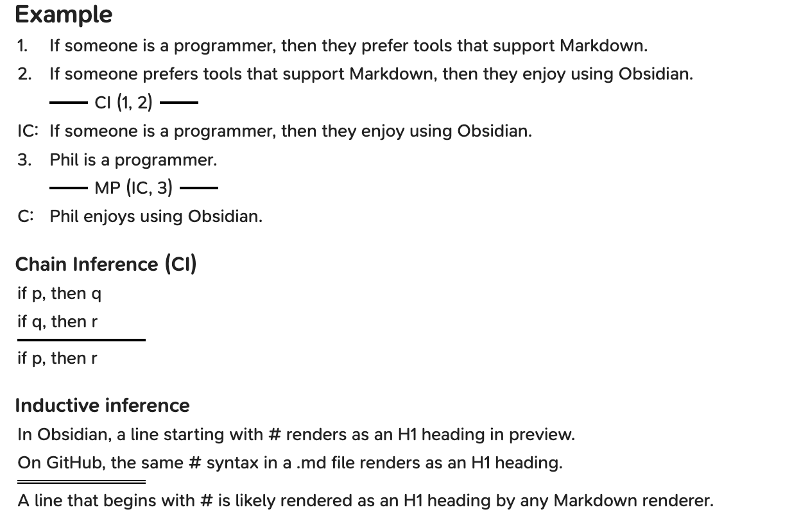

# StandardForm
A plugin for Obsidian that transforms code blocks with logical Standard Form syntax into clean, styled renderings, enhancing readability of logical reconstructions. 
Perfect for philosophy, logic, and formal notation.

## Demo


## Usage
To enable parsing, code blocks have to be specified as "standardform" language.
````markdown
```standardform
1. If someone is a programmer, then they prefer tools that support Markdown.
2. If someone prefers tools that support Markdown, then they enjoy using Obsidian.
 -- CI (1, 2) --
IC: If someone is a programmer, then they enjoy using Obsidian.
3. Phil is a programmer.
-- MP (IC, 3) --
C: Phil enjoys using Obsidian.
```
````
````markdown
```standardform
if p, then q
not q
--
not p
```
````
### Format
- Identifiers must end with either a colon (`:`) or a period (`.`), such as `P1:`, `C1.`, or `Something:`.
  - If you want to use a colon or period in your premisse or conclusion text, it needs to be escaped with a backslash: `Some text\. More text`.
- Identifiers can be ommited.
- Conclusion lines can be written either as `-- any text --` or simply `--` to create a line without text.
  - To indicate a inductive inference,  `==` can be used to draw a double line (also works with `== text ==`)
